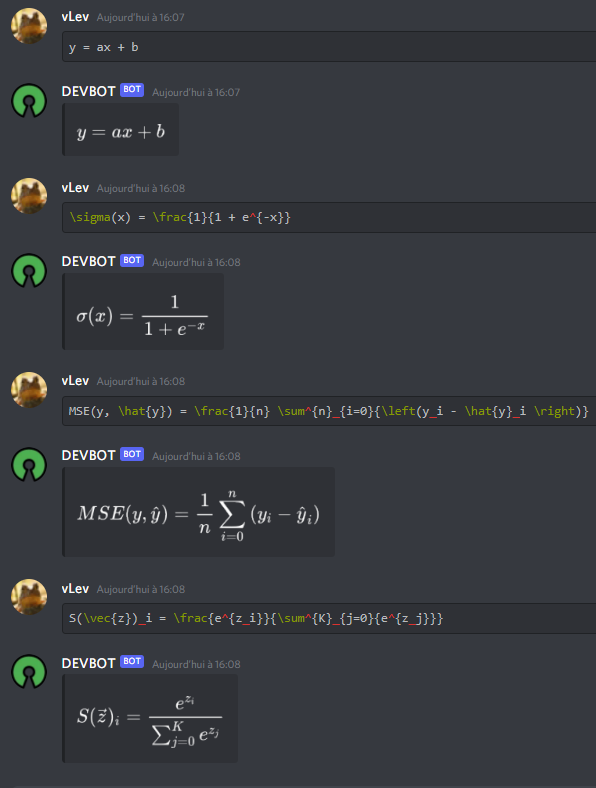
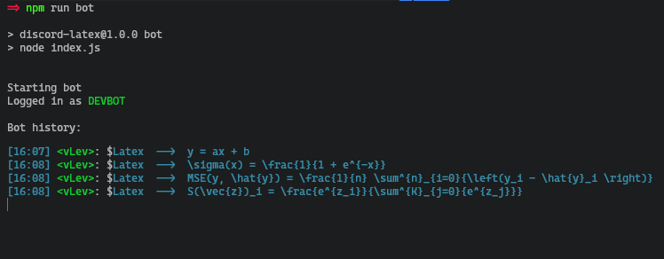

# Discord-Latex

A Discord bot made to render Latex equations

<br/>

### Setup

```
npm run setup
```

This shortcut installed all dependencies & created a `.env` file.
Make sur to add your token in this file like so:
```
TOKEN=your_token_here
```


### Usage

```
npm run bot
```


#### Commands
Open the help menu
```
# in discord channel
$help
```


<br/>

## Preview

bot:

<!--  -->


logs:



These logs are saved automatically in `./logs`.